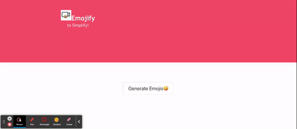

# Emojify-Group Project

## Overview

[Visit the Deployed Site](https://samhiga.github.io/emojify/ )

There are thousands of movies available for streaming. Users end up spending hours to pick a movie. This app makes it easier for users to decide on a movie based on user's moods and inclinations that are expressed through emojis. The user is presented with emojis to pick from and the algorithm recommends a list of movies. If the user ever wants to look at their past movie suggestions, they have option to do so as well.

## Technologies Used


* [HTML](https://developer.mozilla.org/en-US/docs/Web/HTML)
* [CSS](https://developer.mozilla.org/en-US/docs/Web/CSS)      
* [Git](https://git-scm.com/)   
* [DOM](https://developer.mozilla.org/en-US/docs/Web/API/Document_Object_Model/Introduction)
* [JavaScript](https://www.javascript.com/)    
* [jQuery](https://jquery.com/)
* [ajax](https://api.jquery.com/jquery.ajax/)
* [Open Emoji API](https://emoji-api.com/)
* [Streaming Availability Rapid API](https://rapidapi.com/movie-of-the-night-movie-of-the-night-default/api/streaming-availability/details)
* [Bulma](https://bulma.io/)
* [CSS Loaders](https://cssloaders.github.io/)
* [AOS](https://michalsnik.github.io/aos/)

## Table of Contents 

* [User Story](#user-story)
* [APIs](#apis)
* [AOS-library](#aos-library)
* [Code Snippet](#code-snippet)
* [Usage](#usage)
* [Learning Objectives](#learning-objectives)
* [Learning Points](#learning-points)
* [Contributors](#contributors)


## User Story

AS A user I want to get movie suggestions based on how i'm feeling


I WANT to see movie suggestions based on my mood using emojis to identify how i’m feeling


SO THAT I don’t have to spend hours trying to find that one specific movie that I want


### Acceptance Criteria
GIVEN a movie based on current mood web application<br/>
WHEN I choose my mood<br/>
THEN I am presented with a variety of different emojis.<br/>
WHEN I chose an emoji corresponding to my current mood<br/>
THEN I am presented with a variety of different emojis.<br/>
WHEN I chose an emoji I want to watch a movie about<br/>
THEN I am presented with several options<br/>
WHEN website didn’t have a movie about chosen object<br/>
THEN I am presented with default options <br/>
WHEN  I see the web application, <br/>
THEN  it includes interactive features that can accept and respond to user input.<br/>
WHEN creating the web application, <br/>
THEN user input will be validated to ensure that it meets the necessary requirements.<br/>
WHEN I see the web application, <br/>
THEN it includes a repeating element such as a table or columns.<br/>
WHEN I see this web application, <br/>
THEN at least one new library or technology that hasn't been discussed will be used.<br/>
WHEN I open in the web application, <br/>
THEN client-side storage is used to store previous movies that persists across page reloads.<br/>
WHEN I open the web application, on different screens ,<br/>
THEN  it will be made to be responsive to different screen sizes and devices.<br/>


## APIs

### Open Emoji API
The first API our group agreed to use was the Open Emoji API, it ordered the emojis into different groups that made them easy to oraganize which help later as we assigned the categories to out movies.


How we used this API:
```javascript
  var queryURL = "https://emoji-api.com/emojis?access_key=352cbcc2559967a6e748bbd1b737ab1e71d5f6a5"
  $.ajax({
        url: queryURL,
        method: "GET"
    }).then(function(results) {
```

### Streaming Availability Rapid API
The other API we decided to go with was the Streaming Availability API. It provided us with movies from streaming services such as Hulu, Netflix, and some others. We picked the information we wanted from the movies that included genres, release year, an overview, and the ImDB rating


How we used this API:
```javascript
   var settings = {
                "async": false,
                "crossDomain": true,
                "url": `https://streaming-availability.p.rapidapi.com/v2/search/basic?country=us&services=netflix%2Cprime.buy%2Chulu.addon.hbo%2Cpeacock.free&show_type=movie&genre=${genre}&keyword=${keyword}`,
                "method": "GET",
                "headers": {
                    "X-RapidAPI-Key": "b3dbc942ddmsh8add83241714b1ap1ace8ajsn8339705327d6",
                    "X-RapidAPI-Host": "streaming-availability.p.rapidapi.com"
                }
        };
        //using ajax method to get movies
        $.ajax(settings).done(function (data) {
            var response = JSON.parse(data);
            var results = response.result;
```

## AOS Library
We utilized the AOS libary to add animation to our movie tiles.


## Code Snippet
```javascript
   var tile = $('<div class="column is-one-third is-flex">');
    var box = $('<article class="tile is-child box has-background-danger is-align-items-center">');
    var title = $('<p class="title has-text-light">').text(movie.title);
    var year = $('<p class="has-text-light">').text('Year: ' + movie.year);
    var overview = $('<p class="has-text-light">').text (movie.overview);
    var image = $('').attr('src', movie.posterURLs['185']);
```
In the above code I used Bulma to style our movie ID in javascript. Since nothing but the ID of movie was in HTML, this was the best way to style it by using the variables to appended to our ID and applying the Bulma style here. I also had to create the tile and box variables so they would display as a tile as well.

## Usage 

Once on our site, the user will click the generate emoji button. From there they will get 10 emojis to pick from based on there mood. After that they pick another emoji from 10 that represents a keyword. After both emojis are picked, movie suggestions will appear based on those emojis. Users also have the option to look at their past emojis choices and the movies that displayed



## Learning Objectives
1. Applying and solidifying programming fundamentals: The project week is an opportunity for students to put into practice the foundational skills they have learned throughout the bootcamp, such as HTML, CSS, and JavaScript.
2. Working in teams: Many project weeks are designed to simulate real-world development scenarios where students work collaboratively in teams to build a web application. Learning how to work with others in a development environment is an important skill for any aspiring web developer.
3. Developing problem-solving skills: Building a web application requires the ability to solve complex problems and troubleshoot issues that arise. Project weeks challenge students to identify and overcome roadblocks and find creative solutions to technical challenges.
4. Using new technologies: Project weeks often introduce students to new technologies or frameworks that they may not have used before. This can be an opportunity to expand their skillset and learn about the latest tools and techniques in web development.
5. Building a portfolio: The web application that students create during project week can be used as a portfolio piece to showcase their skills and experience to potential employers. Learning how to build a polished and functional web application is a valuable asset for any developer.

## Learning Points:

We learned how to utilize multiple APIs and manipulate them to function the way we want them to. We also gained experience researching other libraries we haven't used before and got better at reading documentation to use them. Another big thing we learned and eperienced was working as team. It was rough at first, but we were able to get into a flow and be more productive. 

## Contributors

[Emanuel Molina](https://github.com/AcquahLopid/) <br />
[Liubov Sobolevskaya](https://github.com/LiubovSobolevskaya) <br />
[Sabeen Chaudhry](https://github.com/sabeen44) <br />
[Sam Higa](https://github.com/samhiga) <br/>
